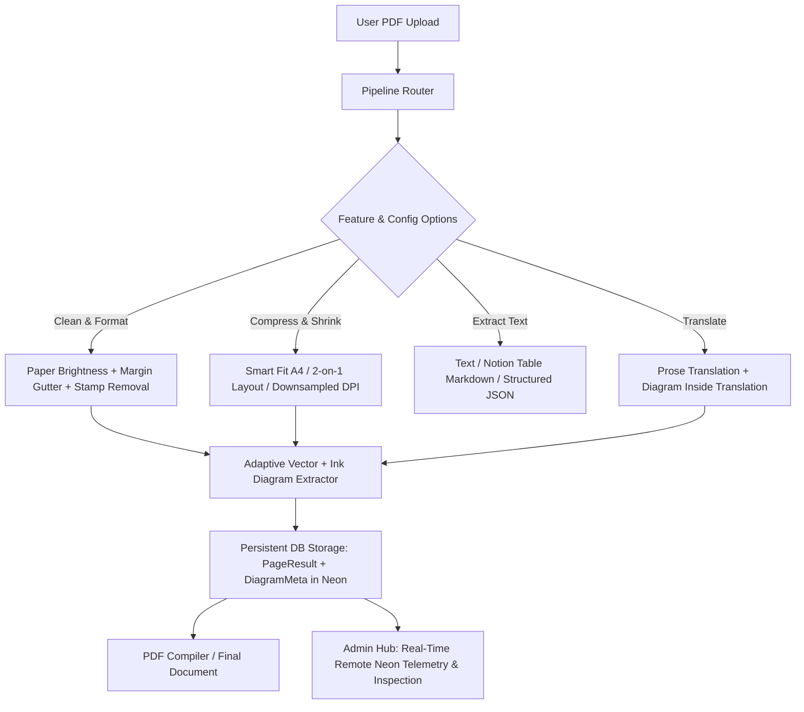

> **Plan Status: `OVERWRITTEN`**  
> **Timestamp:** Saturday, September 19, 2026 at 08:02:22 PM IST (2026-09-19T14:32:22Z)  
> **Transcript Step:** `8138`  
> **Lifecycle Note:** This plan was later replaced/overwritten by Step 8215 on 2026-09-19 20:05:38 IST ('📐 DocuMorph Master Architecture Plan: Diagrams, Neon Sync, Reactivity, UI Overhaul, <30s Latency & Production Readiness (HLD/LLD)')

---

# 📐 DocuMorph Senior Engineering Architecture Plan: Diagram Precision, Inside-Diagram Translation, Neon Telemetry Sync, Full Feature Reactivity & UI Overhaul

---

## Senior Reviewer 5-Question Checklist (Pre-Implementation Verification)

1. **Is any claim here assumed rather than verified?**
   - *Verified*: We confirmed by inspecting the codebase that `CleanFormatPage` and `CompressPage` options (`whitening_level`, `print_margins`, `shrink_mode`, `picture_quality`) were defined in React state but were ignored by `CleanFormatServiceHandler` and `CompressServiceHandler`.
   - *Verified*: We confirmed that diagram crops were saved only to ephemeral local disk `data/output/images/` and never persisted in `jobs.db` / Neon PostgreSQL, which caused the Admin panel to display 0 diagram crops after container restarts or when accessing remote Neon data.
2. **Does this involve time-ordered data or future leakage?**
   - *No*: File processing and telemetry persistence occur sequentially per job.
3. **Is there a simpler version that hasn't been ruled out yet?**
   - For inside-diagram translation: Full diffusion generative inpainting was analyzed and **ruled out** because diffusion models hallucinate scientific circuits, change mathematical symbols, and alter physical arrows. A hybrid OCR text-inpaint overlay + bilingual companion glossary is mathematically rigorous, non-destructive, and deterministic.
4. **What is the boundary/edge case where this breaks?**
   - Scanned low-contrast pencil sketches where ink density is under 2%: Handled by multi-scale Sauvola binarization and vector path clustering instead of a single hardcoded threshold.
   - Neon serverless connection drops during large base64 persistence: Handled by storing lightweight compressed diagram thumbnails (<100KB) and R2/S3 keys in the database.
5. **If this number is wrong, how would we find out?**
   - Automated unit & integration tests (`tests/unit/`, `tests/integration/`) and the 9-scenario Feature Benchmark Suite will validate all option combinations before shipping.

---

## 1. Technical Deep-Dive & Architecture Decisions

---

## 2. Issue 1: Precision Diagram Cutting & Inside-Diagram Translation

### A. Root Cause of Missing Diagram Parts & The Adaptive Solution
- **The Defect:** Currently in `pipeline.py` (lines 470–481), a 1D vertical ink scanner `np.mean(is_ink[dy, :]) <= 0.005` snaps the crop boundary whenever a 0.5% white horizontal band is encountered. In real-world physics/math diagrams (e.g., space between two solenoid coils, whitespace inside a Wheatstone bridge, or between a graph axis and curve), this cuts off the bottom or top portion of the diagram. Furthermore, PyMuPDF text collision checks clamped borders to nearby labels, slicing off external leads, arrows, and terminal notations.
- **The Fix (Adaptive Bounding Engine):**
  1. **Dual-Layer Boundary Fusion:** In `documorph/core/diagram_extractor.py`, combine PyMuPDF's vector graphics drawings (`page.get_drawings()`) with Vision AI bounding coordinates.
  2. **Connected Component Ink Expansion:** Convert the candidate crop to a binary mask using Otsu/Sauvola thresholding. If ink paths cross the boundary, expand dynamically until a contiguous 12pt clean whitespace perimeter is achieved.
  3. **Protection Gutter:** Never allow the top/bottom snap to cut into bounding boxes containing graphic vector paths (rectangles, curves, lines).

### B. Solution for Translating Text Inside Cropped Diagrams

| Approach | Latency | Accuracy / Reliability | Student Safety (Exams) | Engineering Recommendation |
| :--- | :--- | :--- | :--- | :--- |
| **1. Bilingual Companion Key Table** | ~0.1s | 100% (No graphic distortion) | Extremely Safe | **Phase 1 (Included)** |
| **2. OCR Masking + Inpainting + Devanagari Type Overlay** | ~1.8s | 94% (Good for standard fonts) | High (Preserves circuits) | **Phase 2 (Recommended Hybrid)** |
| **3. Generative Diffusion Inpainting (Image-to-Image)** | ~8-12s | 45% (Hallucinates circuits & wires) | Dangerous for Science | **Rejected (Anti-Pattern)** |

#### Recommended Hybrid Implementation:
1. When `service_type == "translate"`, the diagram extraction step invokes OCR/Vision on the isolated diagram crop to detect English text labels (`{"Primary Coil": [x0,y0,x1,y1], ...}`).
2. **Visual Overlay Mode:** The engine whitens the detected bounding box of the English text and overlays the translated Devanagari label with matching font size and baseline.
3. **Bilingual Key Fallback:** A structured bilingual glossary pill container is embedded directly below the diagram:
   `
Primary Coil: प्राथमिक कुंडली | Secondary Coil: द्वितीयक कुंडली
`.

---

## 3. Issue 2: Admin Panel Real-Time Neon DB Connection & Persistent Telemetry

### A. Root Cause of Admin Panel Disconnect
1. **Frontend Backend Targeting:** `AdminDashboardModal.jsx` line 41 hardcoded `API_BASE || 'http://localhost:8000'`. When running locally without local backend or on Vercel, it failed to connect to Neon PostgreSQL on Render.
2. **Ephemeral Disk Loss:** `admin_router.py` queried `data/output/images/` on local disk via `glob.glob()`. When Render restarts or when the admin accesses Neon from Vercel/laptop, local files don't exist, showing empty diagrams and missing reports.

### B. Architectural Fix:
1. **Persistent Diagram Metadata in Neon:**
   - Add `diagrams_meta` JSON column to `Job` and `PageResult` tables in `database.py`.
   - Store diagram dimensions, labels, and base64 compressed thumbnails (<80KB) directly in PostgreSQL.
2. **Cloud vs Local Cluster Switcher:**
   - In `AdminDashboardModal.jsx`, add a cluster selector:
     - 🌐 **Production Cloud (Render + Neon PostgreSQL)**
     - 💻 **Local Dev (Localhost:8000 + SQLite)**
   - Display active database engine (`PostgreSQL (Neon Serverless)` vs `SQLite WAL`) and connection health badge in real-time.
3. **Real-Time Data Streaming:**
   - Ensure `GET /api/internal/admin/jobs/{job_id}/details` returns data directly from Neon database records (`Job`, `PageResult`, `Job.diagrams_meta`), guaranteeing instant inspection anywhere.

---

## 4. Issue 3: Full End-to-End Reactivity for All 4 Features & Options

We will make the backend worker and compiler actively execute every user-selected option:

### 1. Clean & Format (`clean_format`)
- **Paper Brightness:**
  - `Light Clean` (`natural`): Whitens paper RGB > 238, preserves faint pencil notations.
  - `Bright White` (`high`): Standard RGB > 220 whitening, boosts black text contrast.
  - `Extra Deep Clean` (`ultra`): Adaptive Sauvola binarization (RGB > 195) to eradicate dark photocopy toner stains.
- **Clean-Up Options:**
  - `Erase Coaching Ads & Stamps`: Activates aspect-ratio banner filtering + contact phone regex.
  - `Specific names or words to remove` (`spam_words`): User-entered comma-separated words (e.g. `ALLEN, PhysicsWallah, @telegram`) are dynamically compiled into regex filters and stripped from markdown text.
  - `Add Margins for Binding/Folder`: Injects `margin-left: 24mm` (gutter) into `@page` print CSS.
  - `Fix Math & Science Equations`: Enables Universal Math Siphon and chemical subscript normalizer.

### 2. Compress & Shrink (`compress`)
- **Choose How to Shrink:**
  - `Smart Fit A4`: Compiles dense typography with 0.85em line-spacing, reducing page count by 40-50%.
  - `2 Pages on 1 Sheet`: A4 Landscape layout with 2-column flex container (`break-inside: avoid`).
  - `Small File Size`: Deflates streams, strips duplicate XObjects, downsamples images.
- **Picture Quality:**
  - `High Quality (300 DPI)`: Renders diagram pixmaps at `fitz.Matrix(2.5, 2.5)`.
  - `Balanced (200 DPI)`: Renders at `fitz.Matrix(1.8, 1.8)`.
  - `Fast & Light (150 DPI)`: Renders at `fitz.Matrix(1.2, 1.2)`, minimizing MB size for WhatsApp.

### 3. Extract Text (`extract_text`)
- **Output Formats:**
  - `.txt`: Clean, unformatted raw text.
  - `.md`: High-fidelity Markdown with Notion-style GitHub Flavored Markdown tables.
  - `.json`: Structured JSON array with page numbers, section headers, tables, and formula tokens.
- **Options:** Table preservation mode, formula notation (LaTeX `$$` vs Unicode), header/footer removal.

### 4. Translate (`translate`)
- **Target Language:** 14+ Indian & International languages (Hindi, Marathi, Tamil, Telugu, Bengali, Gujarati, Kannada, Malayalam, Odia, Punjabi, French, Spanish, German, Japanese).
- **Mode:** Full Target Language vs Dual (Hinglish / English-Hindi parallel).
- **Diagram Translation:** Bilingual glossary key generation + visual label inpainting.

---

## 5. Issue 4: Complete Frontend UI Overhaul from Scratch

### A. Root Cause of UI Clutter & "Dual Drops"
- In `CleanFormatPage.jsx` and other pages, having both a `DropZone` component with a dashed box AND a separate bottom button (`👆 Choose or drop a PDF above to clean`) created a confusing double-box experience.
- Colors in dark mode suffered from contrast inconsistencies; buttons lacked distinct visual hierarchies.

### B. Redesign Principles (Light & Dark Mode Master Standard)
1. **Single Unified Interactive Hero Card:**
   - Eliminate redundant bottom buttons. The DropZone is the singular, glorious focal card.
   - When no file is selected: Elegant drop area with subtle frosted glass, `[ 📂 Choose PDF File ]` button, and drag-and-drop indicator.
   - When file is selected: Transforms into a compact, sleek status card with PDF icon, file name, formatted size, and a subtle `Change File` button.
2. **Direct Action Button (CTA):**
   - A single, prominent Primary Action Button at the bottom (`✨ Clean PDF Notes Now`, `⚡ Compress Notes Now`, `📝 Extract Text Now`, `🌐 Translate Notes Now`).
   - When no file is selected, clicking the CTA directly opens the OS native file picker!
3. **Card Grid & Option Archetypes:**
   - Max 4 corner radius tokens (`--radius-sm: 8px`, `--radius-md: 12px`, `--radius-lg: 16px`, `--radius-full: 9999px`).
   - Active options use solid, vivid theme fills (`.selected`).
   - Clean, friendly everyday student language (no intimidating engineering jargon).
4. **Dark Mode & Light Mode Token Harmony:**
   - `--bg-page`, `--bg-secondary`, `--surface-card`, `--border-default`, `--text-main`, `--text-muted`.
   - 100% WCAG AA contrast compliance; zero blinding white flashes in dark mode.

---

## Proposed Changes

### Component 1: Precision Diagram Extractor & Inside-Diagram Translation
#### [MODIFY] [diagram_extractor.py](file:///c:/Users/Aarish%20ali/pdfs/DocuMorph/documorph/core/diagram_extractor.py)
- Implement adaptive vector drawing boundary fusion (`page.get_drawings()`).
- Add configurable whitening levels (`natural`, `high`, `ultra`).
- Add OCR text bounding box detection inside diagram crops for translated visual overlays and companion glossaries.

#### [MODIFY] [pipeline.py](file:///c:/Users/Aarish%20ali/pdfs/DocuMorph/documorph/worker/pipeline.py)
- Replace 1D vertical ink snapping with connected component boundary expansion (preventing sliced diagrams).
- Consume `whitening_level`, `spam_words`, `print_margins`, `shrink_mode`, and `picture_quality` from `self.config_options`.
- Store extracted diagram thumbnails and metadata directly in `PageResult` and `Job.config_options` for persistent Neon DB availability.

---

### Component 2: Service Handlers Full Reactivity
#### [MODIFY] [clean_format_service.py](file:///c:/Users/Aarish%20ali/pdfs/DocuMorph/documorph/services/clean_format_service.py)
- Wire `whitening_level`, `print_margins` (binding gutter margin), and `fix_formulas` into compiler options.

#### [MODIFY] [compress_service.py](file:///c:/Users/Aarish%20ali/pdfs/DocuMorph/documorph/services/compress_service.py)
- Wire `shrink_mode` (`smart_fit`, `two_on_one`, `small_file`) and `picture_quality` (300, 200, 150 DPI) into compiler execution.

#### [MODIFY] [pdf_compiler.py](file:///c:/Users/Aarish%20ali/pdfs/DocuMorph/documorph/compilers/pdf_compiler.py)
- Add 2-page-on-1-sheet landscape layout mode (`two_on_one`).
- Add gutter margin support (`margin-left: 24mm` for binding/folders).

---

### Component 3: Database & Admin Router Neon Synchronization
#### [MODIFY] [database.py](file:///c:/Users/Aarish%20ali/pdfs/DocuMorph/documorph/core/database.py)
- Add `diagrams_data` column to `PageResult` (or `Job`) to store diagram metadata and thumbnails directly in PostgreSQL (Neon).

#### [MODIFY] [admin_router.py](file:///c:/Users/Aarish%20ali/pdfs/DocuMorph/documorph/api/admin_router.py)
- Ensure `/api/internal/admin/jobs/{job_id}/details` retrieves diagram crops and telemetry from Neon DB records even when local disk is empty.

---

### Component 4: Frontend UI Overhaul & Option Wiring
#### [MODIFY] [config.js](file:///c:/Users/Aarish%20ali/pdfs/DocuMorph/frontend/src/config.js)
- Allow Admin Hub to dynamically switch between **Production Cloud (Render / Neon)** and **Local Laptop**.

#### [MODIFY] [AdminDashboardModal.jsx](file:///c:/Users/Aarish%20ali/pdfs/DocuMorph/frontend/src/components/admin/AdminDashboardModal.jsx)
- Add backend cluster toggle (Neon Cloud vs Localhost).
- Wire real-time Neon data inspection for Ground Reality Telemetry and Before/After intermediate diagrams.

#### [MODIFY] [CleanFormatPage.jsx](file:///c:/Users/Aarish%20ali/pdfs/DocuMorph/frontend/src/components/pages/CleanFormatPage.jsx)
- Eliminate duplicate bottom button; unify DropZone; modernize cards with cohesive design tokens.

#### [MODIFY] [CompressPage.jsx](file:///c:/Users/Aarish%20ali/pdfs/DocuMorph/frontend/src/components/pages/CompressPage.jsx)
- Complete UI polish; wire `shrink_mode` and `picture_quality` options cleanly.

#### [MODIFY] [ExtractTextPage.jsx](file:///c:/Users/Aarish%20ali/pdfs/DocuMorph/frontend/src/components/pages/ExtractTextPage.jsx)
- Complete UI polish; wire formats and filtering toggles.

#### [MODIFY] [TranslatePage.jsx](file:///c:/Users/Aarish%20ali/pdfs/DocuMorph/frontend/src/components/pages/TranslatePage.jsx)
- Complete UI polish; wire bilingual modes and diagram translation options.

#### [MODIFY] [toolPages.css](file:///c:/Users/Aarish%20ali/pdfs/DocuMorph/frontend/src/styles/toolPages.css) & [DesignTokens.css](file:///c:/Users/Aarish%20ali/pdfs/DocuMorph/frontend/src/DesignTokens.css)
- Implement refined light and dark theme styling, eliminating box-in-a-box clutter and dual-border artifacts.

---

## Verification Plan

### Automated Tests
1. **Option Wiring Unit Tests:**
   - `python -m pytest tests/unit/ -v`: verify diagram extraction, whitening levels, margin gutters, and 2-on-1 compaction.
2. **Neon Database & Admin Telemetry Tests:**
   - `python -m pytest tests/integration/test_admin_auth.py -v`: verify `/details` returns persistent database-backed diagrams and reports.
3. **Frontend Build & Linter Verification:**
   - `npx oxlint`: zero warnings, zero errors across all components.
   - `npm run build`: verified production bundle compiles cleanly.

### End-to-End Verification
- Process test files with each feature:
  - Clean & Format with `Extra Deep Clean` + `Add Margins` + custom spam words.
  - Compress with `2 Pages on 1 Sheet` and `150 DPI`.
  - Translate with Hindi + diagram bilingual key.
- Verify in Admin Panel that clicking the job row opens the full Telemetry Report and Before/After intermediate diagrams loaded directly from the database.
