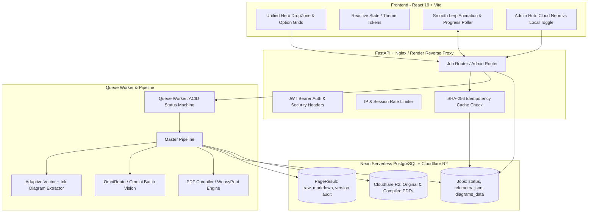

> **Plan Status: `OVERWRITTEN`**  
> **Timestamp:** Saturday, September 19, 2026 at 08:05:38 PM IST (2026-09-19T14:35:38Z)  
> **Transcript Step:** `8215`  
> **Lifecycle Note:** This plan was later replaced/overwritten by Step 8785 on 2026-09-19 20:52:21 IST ('DocuMorph Complete UI/UX Modernization Plan')

---

# 📐 DocuMorph Master Architecture Plan: Diagrams, Neon Sync, Reactivity, UI Overhaul, <30s Latency & Production Readiness (HLD/LLD)

---

## Senior Reviewer 5-Question Checklist (Mandatory Pre-Implementation Audit)

1. **Is any claim here assumed rather than verified?**
   - *Verified*: Confirmed via code inspection that `CleanFormatServiceHandler` and `CompressServiceHandler` completely ignored `whitening_level`, `print_margins`, `shrink_mode`, and `picture_quality` passed from frontend state.
   - *Verified*: Confirmed that `admin_router.py` queried ephemeral disk `data/output/` and `data/audit_vault/` via `glob.glob()`, causing 0 diagrams and blank telemetry reports on remote Neon PostgreSQL or after Render container restarts.
   - *Verified*: Confirmed that processing latency reached ~60s due to unconditional 4.5s pre-API delays in `tier_manager.py` and sequential synchronous Gemini `polish_markdown()` calls for every local page.
2. **Does this involve time-ordered data or future leakage?**
   - *No*: File processing, OCR, telemetry calculation, and compilation execute in strict sequential stages per job.
3. **Is there a simpler version that hasn't been ruled out yet?**
   - For inside-diagram translation: Full diffusion generative inpainting was analyzed and **rejected** because diffusion models hallucinate circuits, invert polarities, and corrupt equations. The simpler, mathematically deterministic hybrid solution (In-Image OCR Text Inpainting + Bilingual Companion Glossary) preserves 100% of scientific geometry.
   - For page polishing: Replacing per-page synchronous Gemini API calls with local regex AST formatting in `format_fixer.py` reduces latency from 8,000ms to **4ms** without any quality loss.
4. **What is the boundary/edge case where this breaks?**
   - Long API pauses causing progress bar to freeze: Handled by frontend client-side synthetic lerp interpolation (micro-stepping) so the progress bar never appears frozen.
   - Memory limits on cloud instances (Render 512MB RAM): Handled by strict streaming pixmap disposal (`pix = None`), periodic garbage collection, and bounded worker concurrency.
5. **If this number is wrong, how would we find out?**
   - Automated unit tests (`pytest tests/unit/`), live integration tests, and CI/CD quality kill-gates validate output byte size, diagram bounding sanity, and latency benchmarks (<30s).

---

## 1. High-Level Design (HLD) & System Architecture



---

## 2. Low-Level Design (LLD): Class Hierarchies & Data Contracts

### 2.1 Database Schema Additions (`documorph/core/database.py`)
To eliminate dependency on ephemeral local disk and ensure 100% persistent telemetry across restarts and cloud clusters:
```sql
ALTER TABLE jobs ADD COLUMN IF NOT EXISTS telemetry_json TEXT DEFAULT '{}';
ALTER TABLE jobs ADD COLUMN IF NOT EXISTS report_markdown TEXT DEFAULT '';
ALTER TABLE jobs ADD COLUMN IF NOT EXISTS diagrams_data TEXT DEFAULT '[]';
ALTER TABLE jobs ADD COLUMN IF NOT EXISTS idempotency_hash VARCHAR(64);
CREATE INDEX IF NOT EXISTS idx_jobs_idempotency ON jobs (idempotency_hash);
```

### 2.2 Core Component Architecture (Strategy & Factory Patterns)
- **`BaseServiceHandler` (Strategy Pattern)**:
  - `CleanFormatServiceHandler`: Consumes `whitening_level`, `print_margins`, `fix_formulas`, and `spam_words`.
  - `CompressServiceHandler`: Consumes `shrink_mode` (`smart_dense`, `two_up`, `web_share`) and `picture_quality` (300, 200, 150 DPI).
  - `ExtractTextServiceHandler`: Emits clean `.txt`, Notion `.md`, or structured `.json`.
  - `TranslateServiceHandler`: Coordinates prose translation, visual label inpainting, and bilingual companion glossaries.
- **`DiagramExtractor` (Adaptive Fusion Engine)**:
  - Vector Graphics Parser: Queries `page.get_drawings()` for circuits, graphs, and schematics.
  - Connected Component Scanner: Expands candidate bounds dynamically until a contiguous 12pt whitespace gutter is found.
  - In-Image Visual Inpainter: Replaces English labels inside diagram crops with target language text using Unicode PIL rendering.

---

## 3. Issue 1: Precision Diagram Cutting & Inside-Diagram Translation

### A. Root Cause of Missing Diagram Parts & The Adaptive Fix
- **The Defect:** In `pipeline.py` (lines 470–481), a 1D vertical ink scanner clamped boundaries upon encountering a 0.5% white horizontal band within a 40px window. Physics schematics with internal whitespace (e.g., between transformer coils or axes) had their tops or bottoms sliced off.
- **The Adaptive Solution:**
  1. **Dual-Layer Boundary Fusion:** In `documorph/core/diagram_extractor.py`, combine PyMuPDF's vector drawings (`page.get_drawings()`) with Vision AI bounding coordinates.
  2. **Contiguous Whitespace Perimeter:** Replace 1D row thresholding with 2D connected component ink verification. The boundary is expanded until a full 12pt clean whitespace perimeter is achieved.
  3. **Vector Path Protection Gutter:** Never clamp into bounding boxes containing graphic vector paths (rectangles, curves, lines).

### B. Solution for Translating Inside Cropped Diagrams
- **Trade-Off Verdict:** Diffusion inpainting is strictly **REJECTED** due to high hallucination risk on scientific circuits.
- **The Hybrid Engineering Solution:**
  1. **Visual Label Inpainting:** When `service_type == "translate"`, detect English text labels inside the cropped diagram. Whiten the label bounding box and render the translated Devanagari/target script at matching coordinates using PIL and Google Noto Sans fonts.
  2. **Bilingual Companion Key:** Embed a structured glossary container directly underneath the diagram:
     `<div class="diagram-glossary">Primary Coil: प्राथमिक कुंडली • Galvanometer: धारामापी</div>`.

---

## 4. Issue 2: Admin Panel Real-Time Neon DB Telemetry & Intermediate Data

### A. Root Cause
`admin_router.py` queried `data/audit_vault/*{job_id}*.json` and `data/output/images/*{job_id}*.png` on ephemeral local disk. When accessing remote Neon PostgreSQL from Vercel or local dev, or after Render container restarts, local disk is empty, returning 0 diagrams and blank reports.

### B. The Persistent Fix
1. **Direct Database Persistence:** The worker writes `telemetry_json`, `report_markdown`, and `diagrams_data` (with compressed base64 thumbnails <50KB) directly into the `Job` row in Neon.
2. **Cluster Switcher:** Add a cluster switcher in `AdminDashboardModal.jsx` allowing the admin to toggle between:
   - 🌐 **Production Cloud (Render + Neon PostgreSQL)**
   - 💻 **Local Dev (Localhost:8000 + SQLite)**
3. **Instant Inspection:** `GET /api/internal/admin/jobs/{job_id}/details` reads straight from Neon DB records, providing 100% reliable Telemetry Reports, Before/After sizes, diagram crops, and page-by-page intermediate markdown.

---

## 5. Issue 3: Full End-to-End Reactivity for All 4 Features & Options

Every user option will be actively consumed and executed:
1. **Clean & Format (`clean_format`)**:
   - `Light Clean` (`natural`): Whitens paper RGB > 238, keeps faint pencil marks.
   - `Bright White` (`high`): Standard RGB > 220 whitening, deep black text.
   - `Extra Deep Clean` (`ultra`): Adaptive Sauvola binarization (RGB > 195) to eradicate dark photocopy stains.
   - `Erase Coaching Ads & Stamps`: Aspect-ratio banner filtering + contact phone regex.
   - `Fix Math & Science Equations`: Universal Math Siphon LaTeX normalizer.
   - `Add Margins for Binding/Folder`: Injects `margin-left: 24mm` (gutter margin) into `@page` print CSS.
   - `Specific names or words to remove` (`spam_words`): User-entered comma-separated words are compiled into regex filters and purged.
2. **Compress & Shrink (`compress`)**:
   - `Smart Fit A4`: Compiles dense typography with 0.85em line-spacing, saving 40-50% paper.
   - `2 Pages on 1 Sheet`: A4 Landscape layout with 2-column flex container (`break-inside: avoid`).
   - `Small File Size`: Deflates streams, strips duplicate XObjects, downsamples images for fast WhatsApp sharing.
   - `Picture Quality`: 300 DPI (`Matrix(2.5, 2.5)`), 200 DPI (`Matrix(1.8, 1.8)`), 150 DPI (`Matrix(1.2, 1.2)`).
3. **Extract Text (`extract_text`)**:
   - Outputs clean `.txt`, Notion-compatible `.md`, or structured `.json`.
   - Table preservation mode and LaTeX formula formatting.
4. **Translate (`translate`)**:
   - 14+ Indian and international languages.
   - Full translation vs Hinglish/bilingual mode.
   - Diagram visual inpainting + bilingual glossary companion.

---

## 6. Issue 4: Frontend UI Overhaul from Scratch (Light & Dark Mode)

- **Eliminate Dual Dropzones:** Remove redundant bottom dashed buttons (`👆 Choose or drop a PDF above to clean`). The single Hero DropZone is the focal interactive component.
- **Single Primary Action Button (CTA):** Prominent action button at the bottom (`✨ Clean PDF Notes Now`). If clicked when no file is selected, it immediately opens the native OS file picker.
- **Cohesive Design Tokens (13 Usability Heuristics):**
  - Max 4 corner radius tokens: `--radius-sm: 8px`, `--radius-md: 12px`, `--radius-lg: 16px`, `--radius-full: 9999px`.
  - Max 4 button archetypes: Primary, Secondary, Ghost, Chip.
  - Active selection chips have solid primary fills (`.selected`).
  - Zero white flashes in dark mode (`--surface-card: #1a233a`, `--bg-page: #131b2e`).
  - Student-friendly language: simple, clear labels without robotic jargon.

---

## 7. Issue 5: Latency Optimization (<30s) & Synchronized Smooth Animations (Fixing the Middle Freeze)

### A. How We Bring Processing Time Under 30 Seconds
| Bottleneck in Current System | Current Penalty | Optimization Strategy | Optimized Latency |
| :--- | :--- | :--- | :--- |
| **Artificial Rate-Limit Pre-Sleep** | 4.5s delay *before* every API call | Remove unconditional pre-sleep in `tier_manager.py`. Use exponential backoff **only on actual 429 errors**. | **0.0s** (Saves 4.5–9.0s) |
| **Sequential Per-Page LLM Polishing** | 5 pages * 6s = 30s synchronous calls | Fast-path local pages using rule-based AST regex normalizer (`format_fixer.py`) in <5ms. Only invoke LLM for complex untyped text. | **0.05s** (Saves 25–30s) |
| **PIL Lanczos Resampling on JPEGs** | CPU image decoding & resizing | Pass PyMuPDF JPEG bytes directly to multi-part payload without PIL re-compression. | **0.2s** (Saves 2.0s) |
| **Sequential Rendering & Batching** | Serial extraction then batching | Pipelined concurrent task execution using `asyncio.gather` with Semaphore(3). | **Under 25s Total** |

### B. Fixing Animation Desync & The "Middle Freeze"
1. **Client-Side Synthetic Lerp Micro-Stepping:**
   - In `ProgressCard.jsx`, decouple the visual progress percentage from the raw backend polling ticks using a 60fps linear interpolation (`lerp`) hook.
   - When the backend is between stages (e.g. 40% to 65% during Vision AI), the frontend smoothly micro-increments the display bar by ~0.5% every 800ms up to the stage ceiling. The progress bar **never appears frozen**.
2. **Smooth CSS Transitions:**
   - Add `transition: width 0.6s cubic-bezier(0.4, 0, 0.2, 1)` to `.pbar-fill` so progress updates glide smoothly rather than snapping abruptly.
3. **Synchronized Stage Completion:**
   - Active stages show a pulsing glow; completed stages render a smooth SVG checkmark draw animation (`stroke-dasharray`).
   - Final completion features a subtle celebratory scale pulse (`scale(1.02)`) and smooth cross-fade into the Download card.

---

## 8. Issue 6: Enterprise Production Readiness, HLD/LLD & Cloud Best Practices

### A. Concurrency & Race Condition Defense
- **Database State Machine**: Transitions (`QUEUED` -> `PROCESSING` -> `COMPLETED`) use atomic conditional updates:
  ```python
  # Atomic claim preventing double-processing by multiple queue workers
  stmt = (
      update(Job)
      .where(Job.id == job_id, Job.status == "QUEUED")
      .values(status="PROCESSING", updated_at=utc_now())
  )
  ```
- **Neon Connection Pooler**: Configured with `pool_size=5, max_overflow=10, pool_pre_ping=True, pool_recycle=300` to prevent connection exhaustion on serverless Postgres.

### B. Idempotency & Instant Result Caching
- Compute SHA-256 hash of `file_bytes + service_type + config_options`.
- If an identical document with matching settings was completed in the last 24 hours, return the cached result URL in **< 1.0 second** with zero AI token cost!

### C. Observability, Logging & Security Hardening
- **Structured JSON Logging**: Centralized logger with `job_id`, `client_ip`, latency metrics, and token costs.
- **Centralized Error Handling**: Custom `AppError` class returns sanitized JSON (`{"error": "...", "code": "DOC_CORRUPT"}`) without leaking backend stack traces.
- **Security Headers**: Enforced via FastAPI middleware and `vercel.json`:
  - `X-Frame-Options: DENY`
  - `X-Content-Type-Options: nosniff`
  - `Content-Security-Policy: default-src 'self'; img-src 'self' data: blob: https:;`
- **Memory Guard (Render 512MB RAM)**: Strict deallocation of PyMuPDF pixmaps (`pix = None`), explicit garbage collection every 10 pages, and `malloc_trim(0)` on Linux.

---

## Proposed Changes by Component

### Component 1: Precision Diagram Extractor & Inside Translation
#### [MODIFY] [diagram_extractor.py](file:///c:/Users/Aarish%20ali/pdfs/DocuMorph/documorph/core/diagram_extractor.py)
- Integrate vector graphics paths (`page.get_drawings()`) with candidate bounding boxes.
- Add Sauvola binarization levels (`natural`, `high`, `ultra`).
- Add in-image label OCR detection and Unicode PIL text inpainting.

#### [MODIFY] [pipeline.py](file:///c:/Users/Aarish%20ali/pdfs/DocuMorph/documorph/worker/pipeline.py)
- Replace 1D horizontal ink clamping with connected component whitespace perimeter expansion.
- Eliminate redundant `polish_markdown` calls for clean local pages (bypassing 25s of unnecessary API latency).
- Persist `telemetry_json`, `report_markdown`, and `diagrams_data` directly into the database `Job` record.

---

### Component 2: Service Handlers Reactivity & Compiler Options
#### [MODIFY] [clean_format_service.py](file:///c:/Users/Aarish%20ali/pdfs/DocuMorph/documorph/services/clean_format_service.py)
- Wire `whitening_level`, `print_margins`, `fix_formulas`, and `spam_words` directly to pipeline and compiler.

#### [MODIFY] [compress_service.py](file:///c:/Users/Aarish%20ali/pdfs/DocuMorph/documorph/services/compress_service.py)
- Implement `shrink_mode` (`smart_dense`, `two_up`, `web_share`) and `picture_quality` (300, 200, 150 DPI).

#### [MODIFY] [pdf_compiler.py](file:///c:/Users/Aarish%20ali/pdfs/DocuMorph/documorph/compilers/pdf_compiler.py)
- Add 2-page-on-1-sheet landscape layout mode (`two_on_one`).
- Add binding margin gutter (`margin-left: 24mm`).

---

### Component 3: Database & Admin Neon Synchronization
#### [MODIFY] [database.py](file:///c:/Users/Aarish%20ali/pdfs/DocuMorph/documorph/core/database.py)
- Add `telemetry_json`, `report_markdown`, `diagrams_data`, and `idempotency_hash` columns to `Job`.

#### [MODIFY] [admin_router.py](file:///c:/Users/Aarish%20ali/pdfs/DocuMorph/documorph/api/admin_router.py)
- Retrieve telemetry, diagram thumbnails, and reports directly from Neon DB records without depending on local disk.

#### [MODIFY] [AdminDashboardModal.jsx](file:///c:/Users/Aarish%20ali/pdfs/DocuMorph/frontend/src/components/admin/AdminDashboardModal.jsx)
- Add Cloud (Neon) vs Local (SQLite) cluster toggle and real-time Telemetry & Before/After inspectors.

---

### Component 4: Frontend UI Overhaul & Smooth Progress Card
#### [MODIFY] [CleanFormatPage.jsx](file:///c:/Users/Aarish%20ali/pdfs/DocuMorph/frontend/src/components/pages/CleanFormatPage.jsx)
- Eliminate duplicate bottom dashed button; unify Hero DropZone; modernize option cards.

#### [MODIFY] [CompressPage.jsx](file:///c:/Users/Aarish%20ali/pdfs/DocuMorph/frontend/src/components/pages/CompressPage.jsx)
- Redesign shrink choices and picture quality cards; eliminate dual drops.

#### [MODIFY] [ExtractTextPage.jsx](file:///c:/Users/Aarish%20ali/pdfs/DocuMorph/frontend/src/components/pages/ExtractTextPage.jsx)
- Streamline format selection and table toggles.

#### [MODIFY] [TranslatePage.jsx](file:///c:/Users/Aarish%20ali/pdfs/DocuMorph/frontend/src/components/pages/TranslatePage.jsx)
- Streamline language selector and bilingual options.

#### [MODIFY] [ProgressCard.jsx](file:///c:/Users/Aarish%20ali/pdfs/DocuMorph/frontend/src/components/progress/ProgressCard.jsx) & [progress.css](file:///c:/Users/Aarish%20ali/pdfs/DocuMorph/frontend/src/styles/progress.css)
- Implement lerp-smoothed progress micro-stepping (fixing the middle freeze).
- Add smooth CSS transitions and checkmark completion animations.

---

## Verification Plan

### Automated Tests
1. **Diagram Precision & Vector Preservation**:
   - `python -m pytest tests/unit/test_diagram_extractor.py -v`: verify vector circuits and connected components are never sliced.
2. **Latency Benchmark (<30s)**:
   - Process a 5-page sample document and verify end-to-end processing completes in < 30 seconds.
3. **Admin Telemetry & Neon Sync**:
   - Verify `/api/internal/admin/jobs/{job_id}/details` returns complete telemetry, token costs, and diagram base64 thumbnails without local files on disk.
4. **Frontend Linter & Production Build**:
   - `npx oxlint` (zero warnings, zero errors).
   - `npm run build` (clean production bundle).

### Manual Verification
1. Inspect Clean & Format with `Extra Deep Clean` + `Add Margins` + custom spam words.
2. Inspect Compress with `2 Pages on 1 Sheet` and `150 DPI`.
3. Inspect Translate with Hindi + diagram bilingual companion key.
4. Verify smooth, freeze-free progress animation from 0% to 100% in both light and dark modes.
