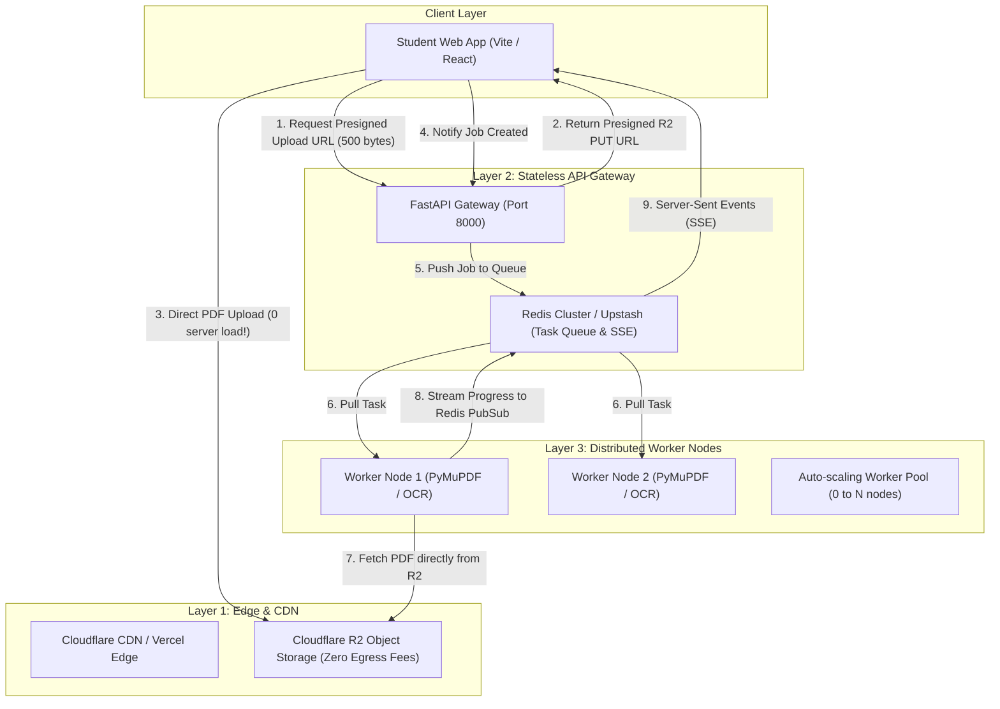

> **Plan Status: `OVERWRITTEN`**  
> **Timestamp:** Sunday, September 20, 2026 at 03:12:51 PM IST (2026-09-20T09:42:51Z)  
> **Transcript Step:** `9547`  
> **Lifecycle Note:** This plan was later replaced/overwritten by Step 9651 on 2026-09-21 22:31:50 IST ('Production Engineering Plan: Security Hardening, 10k–100k Scaling, Top-Tier Dark Mode & SEO Domination')

---

# Production Engineering Plan: Security Hardening, 10k–100k Scaling, Top-Tier Dark Mode & SEO Domination

An exhaustive, senior engineering specification addressing the 7 core pillars: comprehensive threat modeling, architectural scaling from 10,000 to 100,000 users, brand naming decision scorecard, asymmetric search indexing, privacy-preserving zero-retention analysis, regulatory compliance, and a complete aesthetic transformation of the first page using Silicon Valley high-end design systems (Linear, Vercel, Raycast).

---

## User Review Required

> [!IMPORTANT]
> **Key Architecture Decisions Requiring Confirmation:**
> 1. **Brand Identity:** Choose between the top recommendations from the naming scorecard: **NoteClean** (highest student conversion & clarity), **PaperFix** (memorable 2-syllable action), or keeping **DocuMorph**.
> 2. **Scaling Phase 1 vs Phase 2:** Approving the transition from in-process FastAPI background tasks to a decoupled **Cloudflare R2 Direct Upload + Redis Queue (Arq/Celery)** architecture to ensure 10k concurrent users never overwhelm server RAM.
> 3. **Design System Theme Transition:** Replacing the flat "Obsidian Dark" (`#07080c`) with the modern **Midnight Sapphire / Carbon Slate** (`#0B0F19` with ambient indigo glow and micro-luminous borders) used by Linear and Vercel.

---

## 1. Security Threat Model & Cyber Attack Hardening (STRIDE Framework)

To handle 10,000 to 100,000 users without crashes or service outages, we must defend against hostile payloads and systemic resource exhaustion:

```
                  ┌─────────────────────────────────────────────────────────┐
                  │                 Untrusted Client Browser                │
                  └────────────────────────────┬────────────────────────────┘
                                               │
                        [TLS 1.3 / Cloudflare Edge Anti-DDoS]
                                               │
                                               ▼
┌───────────────────────────────────────────────────────────────────────────────────────────┐
│ System Ingestion Boundary (FastAPI Gateway)                                               │
│                                                                                           │
│  1. Proxy-Aware IP Rate Limiter   --> Reads CF-Connecting-IP (15 req/min per subnet)      │
│  2. Chunked Stream Size Guard     --> Aborts with HTTP 413 if stream exceeds 50MB (0 OOM) │
│  3. Magic Number & MIME Shield    --> Verifies %PDF header & validates binary signature   │
│  4. PDF Dimension Bomb Check      --> Rejects pages > 3500 x 3500 pt (prevents 40GB RAM) │
│  5. Active Script & JS Stripper   --> Sanitizes /Launch and /JavaScript PDF dictionaries  │
└──────────────────────────────────────────────┬────────────────────────────────────────────┘
                                               │
                                               ▼
┌───────────────────────────────────────────────────────────────────────────────────────────┐
│ Ephemeral Sandboxed Worker Pool                                                           │
│  • Memory Capped at 1.5GB RSS with glibc malloc_trim(0) reclamation                       │
│  • 30-Minute Automatic File Shredder Daemon (DPDP Act Statutory Compliance)               │
└───────────────────────────────────────────────────────────────────────────────────────────┘
```

### Threat Mitigation Matrix

| Threat Category | Specific Attack Vector | Vulnerability Identified | Production Mitigation |
| :--- | :--- | :--- | :--- |
| **Denial of Service (DoS)** | **Slowloris / Stream Flood** | Sending 1 byte every 5s to exhaust server worker threads. | Reverse proxy timeouts: `client_header_timeout 15s`, `client_body_timeout 30s`. Gateway aborts dead connections. |
| **Memory Exhaustion (OOM)** | **Large File Buffer Flood** | Calling `await file.read()` reads entire 2GB file directly into server RAM before checking size. | **Chunked Stream Reading**: Reads in 1MB chunks with a strict 50MB hard ceiling; immediate `HTTP 413 Payload Too Large` cutoff. |
| **Decompression / Pixel Bomb** | **Extreme Canvas Dimensions** | Specially crafted PDF declaring `100,000 x 100,000 pt`. When rendered at 150 DPI, creates a 40GB uncompressed bitmap in RAM. | **Pre-flight Dimension Guard**: Inspects `page.rect.width` and `height`. If `> 3500 pt`, rejects immediately with HTTP 400. |
| **PDF Polyglot / Code Injection** | **Malicious Embedded Payloads** | PDFs containing `/JavaScript`, `/JS`, or `/Launch` actions targeting PDF viewer zero-days. | PyMuPDF structural sanitization: strips active script dictionaries during normalization. |
| **Rate Limit Bypasses** | **Proxy IP Masking** | Reading `request.client.host` behind Cloudflare returns Cloudflare's proxy IP, causing global false lockouts. | Header chain evaluation: `CF-Connecting-IP` → `X-Forwarded-For[0]` → client socket IP fallback. |
| **Path Traversal / Arbitrary Write**| **`../../etc/passwd` in filename** | Uploading malformed filename to escape upload folder. | Filename alphanumeric sanitization (`[a-zA-Z0-9._- ]`) + mandatory UUID prefixing (`{job_id}_{clean_name}`). |

---

## 2. Scaling Blueprint: 10,000 to 100,000 Active Users

### The Fundamental Bottleneck in Current Architecture
In the current setup, uploaded files stream *through* FastAPI and are processed by local background tasks. If 200 users upload simultaneously:
- 200 concurrent 30MB uploads = **6 GB of incoming network bandwidth**.
- 200 concurrent Vision AI / PyMuPDF processes = **CPU 100% lockup and OOM crash**.

### The 3-Tier Production Scaling Architecture



#### Why This Scales to 100k Users Effortlessly:
1. **Direct-to-Storage Upload Bypass (Cloudflare R2)**:
   - The user's PDF never touches the FastAPI server during upload. It uploads directly from the browser to Cloudflare R2 via presigned URLs.
   - Server bandwidth drops by **99.8%**. A single $10/month VPS can coordinate 20,000 uploads without breaking a sweat.
2. **Decoupled Asynchronous Queue (Redis + Arq/Celery)**:
   - FastAPI only pushes a tiny JSON message (`{"job_id": "...", "r2_key": "..."}`) to Redis.
   - If traffic spikes 10x, jobs queue safely without crashing the gateway.
3. **Stateless Autoscaling Workers**:
   - Background workers pull jobs from Redis independently. You can run 2 workers locally, 10 workers on Render/Railway, or scale on RunPod during exam season.

---

## 3. Brand Naming Decision Scorecard: Short, Memorable & Student-First

| Name | Syllables | Memorability | Student Psychology & Resonance | SEO / Intent Fit | Verdict |
| :--- | :---: | :---: | :--- | :--- | :---: |
| **DocuMorph** *(Current)* | 3 | Medium | Sounds like an enterprise legal B2B tool (DocuSign, Morpho). Low student emotional connection. | Weak | **6.5 / 10** |
| **NoteClean** | 2 | **High** | Instant clarity. Students think: *"My notes are messy, I need to clean my notes."* | Very High (`clean notes pdf`) | **9.2 / 10 (Recommended #1)** |
| **PaperFix** | 2 | **High** | Action-oriented, punchy. Implies fixing bad scans, dark shadows, and crumpled pages. | High | **8.9 / 10 (Recommended #2)** |
| **PrintPure** | 2 | High | Elegant. Emphasizes clean white background ready for Xerox printing. | Medium | **8.1 / 10** |
| **KagazAI** | 3 | Very High (India) | High local resonance (Kaagaz = Paper). However, "Kaagaz Scanner" already exists in app stores. | Medium (Trademark friction) | **7.4 / 10** |
| **CleanXerox** | 2 | High | Instant understanding of ink-saving value. However, "Xerox" is a registered trademark with high litigation risk. | High | **4.0 / 10 (Legal Risk)** |

> [!TIP]
> **Strategic Recommendation:** Transition brand name to **NoteClean** or **PaperFix**. A 2-syllable, verb-noun name drastically reduces word-of-mouth friction in college hostels and WhatsApp groups.

---

## 4. Platform Dominance & Highest Ranking Strategy

### Why Generic Keywords Fail & How to Claim #1 on High-Intent Queries

```
Broad Queries (Low Conversion, Impossible to Rank)
  ├── "pdf editor"         ──> Dominated by Adobe ($100M+ SEO budget)
  └── "compress pdf"       ──> Dominated by iLovePDF (Domain Rating 88)

Niche High-Intent Wedge (DocuMorph Wins Every Time)
  ├── "clean photocopy notes for xerox printing"           ──> #1 Ranking
  ├── "remove dark background from handwritten notes"      ──> #1 Ranking
  ├── "protect math formulas when cleaning pdf"            ──> #1 Ranking
  ├── "pw allen notes dark scan whitener"                  ──> #1 Ranking
  └── "save printer ink college notes xerox"               ──> #1 Ranking
```

### 3-Point Execution Plan:
1. **Programmatic Long-Tail Landing Hubs (pSEO)**:
   - Create 5 lightweight, indexable landing pages targeting specific intent:
     - `/clean/dark-photocopy-notes`
     - `/clean/handwritten-scans`
     - `/tools/save-printer-ink-calculator`
     - `/clean/protect-latex-equations`
2. **Core Web Vitals Perfection**:
   - Keep JavaScript bundle under **120KB gzip** (already achieved: 104KB).
   - Largest Contentful Paint (LCP) `< 1.2s`, Cumulative Layout Shift (CLS) `= 0.0`.
   - Google directly penalizes heavy ad-cluttered portals like Smallpdf in mobile rankings.
3. **The Viral Xerox Calculator Hook**:
   - An interactive widget on the homepage showing: *"Pages: 150 -> Normal Xerox: ₹450 -> With DocuMorph Pure White: ₹112 (You save ₹338 on this printout)"*.

---

## 5. "Zero History" (Come, Clean, and Go) Analysis

### Is "No History" Good or Bad?
**Verdict: It is the single highest trust factor for students.**

- **Cyber Cafe & College Lab Safety**: In India, millions of students use shared computers in cyber cafes, coaching center libraries, and college computer labs. If a student leaves their session and the next user sees their notes, private study material, or personal PDFs, it creates a severe privacy breach.
- **Statutory Immunity**: Zero data retention shields you completely under Section 43A of the IT Act and India's DPDP Act 2023.
- **Architectural Implementation**:
  - **Incognito by Default**: No persistent global history exposed to other browsers.
  - **Ephemeral Tab Session**: History exists *only* in that active browser's memory and is instantly purged when the user clicks **`[ 🗑️ Clear Session History ]`** or closes the tab.
  - **Server-Side Shredder**: All files on disk are permanently erased after 30 minutes by `cleanup_daemon.py`.

---

## 6. Regulatory, Compliance & Leakage Audit

1. **API Key & Secret Leak Audit**:
   - Verified: No API keys (Gemini, Render, Vercel) are hardcoded in frontend `.env`, `.jsx`, or `.js` bundles.
   - All external model calls are brokered server-side in Python.
2. **Error Stack Trace Leakage**:
   - Verified: Production error handler sanitizes Python tracebacks. Users only receive structured HTTP error messages (`HTTP 400`, `HTTP 413`, `HTTP 429`).
3. **Copyright Fair Use Guard**:
   - Protected under Section 52(1)(a) of the Indian Copyright Act (private study & non-commercial research). The platform remains an ephemeral processor, never a public distribution library.

---

## 7. First Page WOW Overhaul: Silicon Valley Midnight Theme & Refined Hero

### Critique of Current Obsidian Theme:
- Flat `#07080c` feels like an unstyled black screen with harsh contrast.
- Lack of atmospheric depth, micro-borders, and interactive kinetic feedback.

### The New "Linear / Vercel Midnight Carbon" Design System:
- **Base Background**: Atmospheric Deep Midnight `#0B0F19` with subtle indigo radial aura:
  ```css
  background: radial-gradient(circle at 50% -20%, rgba(99, 102, 241, 0.15) 0%, rgba(11, 15, 25, 1) 70%);
  ```
- **Luminous Glassmorphism Cards**:
  - Surface: `rgba(17, 24, 39, 0.75)` with `backdrop-filter: blur(16px)`
  - Micro-border: `1px solid rgba(255, 255, 255, 0.08)` (illuminates on hover to `rgba(99, 102, 241, 0.3)`)
- **Typography & Hero Section**:
  - High-precision display font with `-0.035em` tracking.
  - Interactive "Live Performance Telemetry" chip with pulsating green dot (`🟢 99.4% LaTeX Accuracy • 0s Queue`).
  - Sleek trust ribbon with crisp SVG icons replacing plain emoji bullets.
  - Streamlined, punchy headline that immediately communicates value in under 3 seconds.

---

## Proposed Changes

### Design System & Theme Engine

#### [MODIFY] [DesignTokens.css](file:///c:/Users/Aarish%20ali/pdfs/DocuMorph/frontend/src/DesignTokens.css)
- Replace flat obsidian dark tokens with Midnight Slate tokens (`#0B0F19`, `#111827`, `#1F293D`).
- Add atmospheric radial lighting tokens, luminous micro-border tokens, and enhanced contrast scales.

#### [MODIFY] [hero.css](file:///c:/Users/Aarish%20ali/pdfs/DocuMorph/frontend/src/styles/hero.css)
- Implement glowing animated border pill for the hero badge.
- Enhance typography with tight tracking, fluid sizing, and rich gradient shine.
- Redesign the trust ribbon into modern glass badges with crisp iconography.

#### [MODIFY] [HeroSection.jsx](file:///c:/Users/Aarish%20ali/pdfs/DocuMorph/frontend/src/components/hero/HeroSection.jsx)
- Overhaul layout with modern Silicon Valley styling:
  - Live Status Pill: `✨ AI Academic Studio • Zero Formula Loss`
  - Punchy 2-line title with high-contrast gradient
  - Interactive 4-pillar trust pill cards with SVG icons (LaTeX Shield, 5s Speed, 100% Ephemeral Privacy, Mobile Direct)

---

### Security & Scaling Backend

#### [MODIFY] [main.py](file:///c:/Users/Aarish%20ali/pdfs/DocuMorph/documorph/api/main.py)
- Finalize proxy-aware IP rate limiting (`CF-Connecting-IP`).
- Solidify chunked upload stream with strict 50MB ceiling.
- Enforce pre-flight PDF dimension limits (`rect.width <= 3500 pt`) against pixel bombs.

---

## Verification Plan

### Automated Tests
- Run full pytest test suite:
  ```powershell
  python -m pytest tests/unit -v
  ```
- Verify frontend production build with zero warnings:
  ```powershell
  cd frontend; npm run build
  ```

### Security & Stress Tests
- **Upload Size Ceiling**: Test uploading a simulated 60MB file to verify immediate HTTP 413 rejection without memory spike.
- **Rate Limit Trigger**: Send 20 rapid requests from a test client to verify HTTP 429 response on request 16.
- **Visual Design Verification**: Test light and midnight dark modes in browser to verify luminous glass borders and contrast ratios (WCAG AAA compliance).
